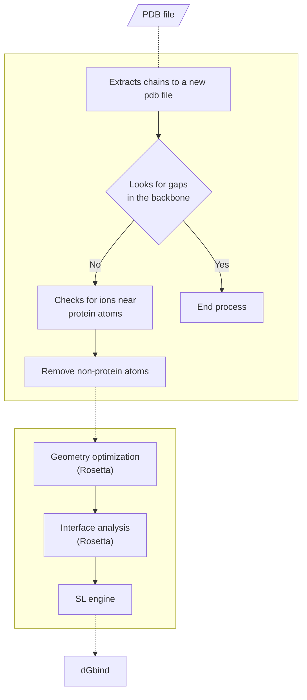

## Overview
PBEE (**P**rotein **B**inding **E**nergy **E**stimator) is an easy-to-use pipeline written in Python3 that use a ML model based on Rosetta descriptors to predict the free energy of binding of protein-protein complexes.

The PBEE workflow is shown below:



## Requirements

| Package        | Version |
|----------------|---------|
| python         | 3.10    |
| RosettaCommons | 3.12    |
| scikit-learn   | 1.3.0   |
| xgboost        | 2.0.1   |
| numpy          | 1.24.4  |
| pandas         | 2.0.3   |


**⚠️ Warning**: RosettaCommons binaries are not available in this repository and must be installed and configured correctly before running PBEE. More information on downloading, installing and configuring can be found on the software's website (https://www.rosettacommons.org/).

**⚠️ Warning**: After installing Rosetta on your workstation, it is essential that you compile the DAlphaBall executable in source/external/DAlpahBall. This is done by navigating to main/source/external/DAlpahBall and typing make. (You may need to make platform-specific settings in the Makefile.)

## Download & Install

#### Step 1 - Clone this repository on your computer or download it:

```
git clone https://github.com/chavesejf/pbee
```

#### Step 2 - Installing requirements 

Open the terminal (ctrl + alt + t) and run the following command:

```
pip3 install -r requirements.txt
```

#### Step 3 - 

## Arguments description

| Argument          | Mandatory | Description |
|-------------------|-----------|-------------|
| -\-ipdb            | Yes      | Input files in the PDB format |
| -\-partner1        | Yes      | Chain ID of the binding partner (e.g.: receptor) |
| -\-partner2        | Yes      | Chain ID of the binding partner (e.g.: ligand) |
| -\-odir            | No       | Folder path to save the output files |
| -\-ion_dist_cutoff | No       | Cutoff distance to detect ion(s) close to the protein atoms |          
| -\-force_mode      | No       | Ignore warning messages and continue |

## Usage

The example below includes the structure of an antibody (HyHEL-63) that binds to lysozyme C (PDB 1XGU) with a binding affinity of -11.28 kcal/mol. In the PDB file, the heavy and light chains of the antibody (ligand) are labeled “A” and “B” chain, respectively, while lysozyme C (receptor) is labeled “C”. Therefore, the PBEE should be run as follows:

``` 
cd /path/to/pbee/folder
```
```
python3 pbee.py --ipdb ./test/pdbs/1xgu.pdb --partner1 AB --partner2 C --odir ./test
```

The above command will redirect the outputs to `/path/to/pbee/folder/test/pbee_outputs/1xgu`.

## Description of the Rosetta XML script

The following is an example of a Rosetta XML script used in the PBEE. In general, the script outlines a pipeline for analyzing and manipulating protein structures, utilizing a variety of scoring functions, residue selectors, simple metrics, filters, movers, and protocols. In this context, the script aims to assess and refine interactions between two protein chains, focusing on interaction energy and structural features. Furthermore, the script includes steps for minimization, energy metric calculation, and structure selection based on specific filters. 

```xml
<ROSETTASCRIPTS>
<SCOREFXNS>
	<ScoreFunction name="beta" weights="beta_nov16"/>
</SCOREFXNS>
<RESIDUE_SELECTORS>
	<Chain name="partner1" chains="AB"/>
	<Chain name="partner2" chains="C"/>
</RESIDUE_SELECTORS>
<TASKOPERATIONS>
	<InitializeFromCommandline name="init"/>
</TASKOPERATIONS>
<SIMPLE_METRICS>
	<InteractionEnergyMetric name="ie" residue_selector="partner1" residue_selector2="partner2" scorefxn="beta"/>
</SIMPLE_METRICS>
<FILTERS>
	<ShapeComplementarity name="sc" residue_selector1="partner1" residue_selector2="partner2" confidence="0"/>
	<ContactMolecularSurface name="cms" distance_weight="0.5" target_selector="partner1" binder_selector="partner2" confidence="0"/>
	<InterfaceHoles name="holes" jump="1" confidence="0"/>
	<Ddg name="ddg_filter1" scorefxn="beta" jump="1" chain_num="2" repeats="1" repack="0" repack_bound="0" repack_unbound="0" threshold="99999" confidence="0"/>
</FILTERS>
<MOVERS>
	<MinMover name="min1" scorefxn="beta" jump="1" max_iter="50000" tolerance="0.0001" cartesian="0" bb="0" chi="1" bb_task_operations="init" chi_task_operations="init"/>
	<MinMover name="min2" scorefxn="beta" jump="1" max_iter="50000" tolerance="0.0001" cartesian="0" bb="1" chi="1" bb_task_operations="init" chi_task_operations="init"/>
	<InterfaceAnalyzerMover name="ifa" scorefxn="beta" interface="A_B" packstat="1" interface_sc="1" tracer="1" scorefile_reporting_prefix="ifa"/>
	<RunSimpleMetrics name="iesum" metrics="ie"/>
</MOVERS>
<PROTOCOLS>
	<Add mover_name="min1"/>
	<Add mover_name="min2"/>
	<Add mover_name="iesum"/>
	<Add mover_name="ifa"/>
	<Add filter_name="ddg_filter1"/>
	<Add filter_name="cms"/>
	<Add filter_name="sc"/>
	<Add filter_name="holes"/>
</PROTOCOLS>
</ROSETTASCRIPTS>
```

1. The script begins by defining the **scoring functions** to be used, which weigh different energetic terms concerning protein interactions;
2. Subsequently, **residue selectors** are set up to identify the protein chains of interest, labeled as "**partner1**" and "**partner2**." 
3. Task operations are also defined to initialize parameters from the command line. The next script section introduces **simple metrics** that evaluate specific aspects of the protein structure, such as interaction energy between selected residues in the "partner1" and "partner2" chains. 
4. In the **filters** section, a series of filters are defined to assess structural and energetic properties of interactions. These filters encompass calculations of shape complementarity, molecular surface contacts, interface holes, and changes in free energy (ddG). 
5. **Movers** are defined to carry out minimization and interface analysis. This includes minimization with varying parameters and levels of detail, as well as **interface analysis** to evaluate features such as packing and hydrogen bonding. Lastly, protocols are constructed using the defined movers and filters. 
6. The movers and filters are added in a specific sequence to perform desired analysis and refinement steps. This encompasses minimization, metric calculation, interface analysis, and the application of filters to select structures meeting predetermined criteria.

In summary, the XML script represents a detailed plan for protein structure analysis and manipulation using Rosetta. It outlines a series of steps aimed at evaluating protein chain interactions and improving structure quality.

## Citation
